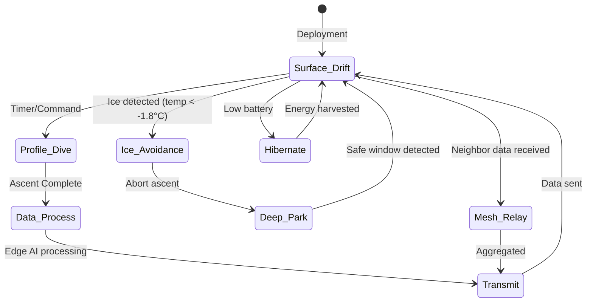

# 🧊 PolarMesh — Complete Research & Strategy Document
## SIH26065: Autonomous Low-Cost Ocean Observation Platform for Polar and Southern Oceans

---

## 1. Problem Statement (Deep Dive)

### 1.1 What MoES is Asking For
> **Category:** Hardware | **Theme:** Robotics & Drones | **Sponsor:** Ministry of Earth Sciences (MoES)

Design and develop an **indigenous, low-cost, autonomous** ocean observation platform for **long-term deployment** in the harsh Polar and Southern Ocean environments. It must measure critical oceanographic and atmospheric parameters autonomously.

### 1.2 Why This Problem Exists

| Gap | Details |
|-----|---------|
| **Observation Desert** | Polar regions are among the **least monitored areas on Earth**. Ship-based expeditions are seasonal, expensive (~₹50-100 Cr per expedition), and limited to summer windows. |
| **Climate Criticality** | The Southern Ocean absorbs ~40% of anthropogenic CO₂ and >75% of excess heat. Gaps in monitoring = gaps in climate models = poor predictions for Indian monsoon. |
| **India's Dependency** | India relies on **foreign platforms** (US Argo, Australian CSIRO buoys, European XCTD). No indigenous autonomous polar observation platform exists. |
| **Cost Barrier** | A single Argo float costs **$15,000–$25,000 USD**. Deep Argo: **$40,000+**. Ice-Tethered Profilers: **$50,000–$100,000+**. India cannot densely deploy these at scale. |
| **Harsh Environment** | Sub-zero temps (−40°C), sea ice crushing, biofouling, 6-month polar nights (no solar), extreme wave stress, remote/GPS-denied under ice. |
| **Data Gaps for India** | NCPOR's IndARC is the only sub-surface mooring India has in the Arctic. India has **zero autonomous drifting platforms** in the Southern Ocean. |

### 1.3 Who Needs This

| Stakeholder | Need |
|-------------|------|
| **NCPOR (Goa)** | Autonomous data collection for Antarctic/Arctic expeditions |
| **NIOT (Chennai)** | Indigenous ocean observation tech (currently OMNI network covers only Indian Ocean) |
| **IMD** | Better Southern Ocean data → better Indian monsoon forecasting |
| **ISRO** | Ground-truth validation for satellite ocean observations |
| **Indian Navy** | Strategic awareness in polar waters |
| **Global Community** | SOOS (Southern Ocean Observing System) needs more observation nodes |

---

## 2. What Currently Exists (Competitive Landscape)

### 2.1 Major Existing Platforms

| Platform | Organization | Cost | Depth | Duration | Limitations |
|----------|-------------|------|-------|----------|-------------|
| **Argo Float (APEX/SOLO)** | Teledyne / SIO | $15K–$25K | 2000m | 4–5 yrs | No under-ice comms, GPS-denied, expensive |
| **Deep Argo** | Various | $40K+ | 6000m | 3–4 yrs | Very expensive, limited ice capability |
| **Ice-Tethered Profiler (ITP)** | WHOI | $50K–$100K+ | 800m | 1–3 yrs | Tied to ice, destroyed when ice melts/breaks |
| **SOFAR Spotter** | Sofar Ocean | ~$5K | Surface only | 1–2 yrs | No depth profiling, not polar-rated |
| **Maker Buoy** | Open-source | ~$300–$500 | Surface only | Months | No polar hardening, no depth sensing |
| **OpenCTD** | Open-source | ~$300–$600 | ~100m | Manual | Not autonomous, needs human operation |
| **BOB (Biophysical Ocean Buoy)** | Research | ~$2,000 | Surface | Months | Not polar-rated, no ice protection |

### 2.2 Key Limitations of Existing Systems

> [!WARNING]
> **No single existing platform simultaneously achieves: low-cost + polar-hardened + autonomous + profiling + satellite telemetry + indigenous (Indian)**

1. **Argo floats** can't communicate under ice → store months of data, risk data loss
2. **ITPs** cost $100K+ and die when ice breaks up
3. **Open-source buoys** (Maker Buoy, BOB, OpenCTD) aren't designed for −40°C polar ops
4. **India has zero indigenous autonomous polar ocean platforms**

### 2.3 India's Current Infrastructure

| Asset | Status |
|-------|--------|
| **IndARC** (Arctic sub-surface mooring) | Joint NCPOR-NIOT, single unit in Kongsfjorden |
| **OMNI Buoy Network** | NIOT, Indian Ocean only (tropical), not polar |
| **RAMA Array** | International collaboration, tropical Indian Ocean |
| **Maitri & Bharati stations** | Antarctic land stations, no ocean autonomous platforms |
| **Sagar Manthan** | New research vessel, ship-based observation only |

---

## 3. Our Solution: **PolarMesh**

### 3.1 Concept: What We're Building

> **PolarMesh** is an indigenous, modular, autonomous, low-cost ocean observation platform designed for **long-term deployment** in Polar and Southern Oceans. It operates as both a **standalone drifter** and a **mesh-networked swarm** to provide persistent, real-time oceanographic data.

### 3.2 USP — What Makes PolarMesh Different

| Feature | PolarMesh | Argo Float | ITP | Maker Buoy |
|---------|-----------|------------|-----|------------|
| **Target Cost** | **< ₹1.5 Lakh (~$1,800)** | ₹12–20 Lakh | ₹40–80 Lakh | ₹25K |
| **Polar Hardened** | ✅ | Partial | ✅ | ❌ |
| **Depth Profiling** | ✅ (0–200m shallow profile) | ✅ (2000m) | ✅ (800m) | ❌ |
| **Edge AI (TinyML)** | ✅ | ❌ | ❌ | ❌ |
| **Mesh Networking** | ✅ (LoRa + Acoustic) | ❌ | ❌ | ❌ |
| **Satellite Telemetry** | ✅ (Iridium SBD) | ✅ | ✅ | Optional |
| **Energy Harvesting** | ✅ (Wave + Solar hybrid) | ❌ (battery only) | ❌ | Solar only |
| **Modular Sensors** | ✅ | Fixed | Fixed | Limited |
| **Indigenous** | ✅ 🇮🇳 | ❌ (US/France) | ❌ (US) | ❌ (US) |
| **Ice-Avoidance AI** | ✅ | Partial (ISA) | N/A | ❌ |

### 3.3 The Name — "PolarMesh"

- **Polar** → Designed for polar oceans
- **Mesh** → Operates in mesh-networked swarms for resilient, cooperative observation

---

## 4. System Architecture

### 4.1 High-Level Architecture

```
┌────────────────────────────────────────────────────────────────────────┐
│                        PolarMesh Platform                             │
│                                                                       │
│   ┌──────────────┐    ┌──────────────┐    ┌──────────────────────┐   │
│   │  Sensor Pod  │    │  Brain Unit  │    │  Comm Stack          │   │
│   │              │    │              │    │                      │   │
│   │ • CTD Sensor │◄──►│ • STM32L4+   │◄──►│ • Iridium 9603N     │   │
│   │ • Pressure   │    │ • TinyML     │    │   (RockBLOCK)       │   │
│   │ • Optical    │    │ • Edge AI    │    │ • LoRa SX1276       │   │
│   │   Backscatter│    │ • Data Comp  │    │   (Inter-buoy mesh) │   │
│   │ • Acoustic   │    │ • Ice-Sense  │    │ • Acoustic Modem    │   │
│   │   Backscatter│    │   Algorithm  │    │   (Under-ice relay) │   │
│   └──────────────┘    └──────────────┘    └──────────────────────┘   │
│                              ▲                                        │
│                              │                                        │
│   ┌──────────────────────────┴──────────────────────────────────┐    │
│   │                    Power System                              │    │
│   │                                                              │    │
│   │  ┌────────────┐  ┌──────────────┐  ┌─────────────────────┐ │    │
│   │  │ Wave Energy │  │ Solar Panel  │  │ Self-Heating LiFePO4│ │    │
│   │  │ Harvester  │  │ (Summer)     │  │ Battery Pack        │ │    │
│   │  │ (Pendulum) │  │              │  │ with BMS            │ │    │
│   │  └────────────┘  └──────────────┘  └─────────────────────┘ │    │
│   └─────────────────────────────────────────────────────────────┘    │
│                                                                       │
│   ┌──────────────────────────────────────────────────────────────┐   │
│   │                   Structural Shell                            │   │
│   │  • HDPE / Delrin outer hull (ice-resistant)                  │   │
│   │  • Aerogel thermal insulation                                │   │
│   │  • IP68 sealed, pressure-rated to 200m                       │   │
│   │  • Modular connector system (wet-mateable)                   │   │
│   └──────────────────────────────────────────────────────────────┘   │
└────────────────────────────────────────────────────────────────────────┘
```

### 4.2 Operational Modes



**Three Operational Modes:**

1. **Drifter Mode** — Free-floating on surface, sampling at intervals, satellite uplink
2. **Profiler Mode** — Controlled buoyancy dive to ~200m, CTD profile, ascent
3. **Mesh Mode** — LoRa relay for neighbor buoys, acoustic relay for under-ice nodes

---

## 5. Detailed Component Design

### 5.1 Sensing Payload

| Parameter | Sensor | Approx. Cost | Power | Accuracy |
|-----------|--------|-------------|-------|----------|
| **Temperature** | PT1000 RTD (custom board) | ₹500 | 2 mW | ±0.002°C |
| **Conductivity/Salinity** | Inductive (custom coil) | ₹2,000 | 10 mW | ±0.01 mS/cm |
| **Pressure/Depth** | MS5837-30BA | ₹1,500 | 1 mW | ±0.2% FS |
| **Optical Backscatter** | TSL2591 + custom LED | ₹800 | 15 mW | Relative |
| **Acoustic Backscatter** | Piezo transducer + amp | ₹1,500 | 20 mW | Relative |
| **GPS** | u-blox MAX-M10S | ₹1,200 | 25 mW | ±2.5m |
| **IMU (tilt/wave)** | ICM-20948 | ₹600 | 3 mW | — |
| **Air Temp / Humidity** | BME280 | ₹300 | 1 mW | ±0.5°C / ±3% |

**Total Sensor Cost: ~₹8,400 (~$100)**

### 5.2 Brain Unit (Compute & AI)

| Component | Choice | Rationale |
|-----------|--------|-----------|
| **Main MCU** | **STM32L4R5ZI** | Ultra-low-power ARM Cortex-M4 with FPU, 640KB SRAM, 2MB Flash, deep sleep: 30 nA |
| **TinyML Framework** | **TensorFlow Lite Micro / Edge Impulse** | Onboard anomaly detection (autoencoder), data compression |
| **Co-processor** | **ESP32-S3** (optional) | For LoRa mesh protocol handling, WiFi for pre-deployment config |
| **Storage** | MicroSD + 16MB QSPI Flash | Buffer months of data if comms fail |

**Edge AI Capabilities:**
- **Ice Sensing Algorithm (ISA)**: Detect sub-surface ice using temp gradient → abort ascent
- **Anomaly Detection**: Flag unusual readings (e.g., sudden temp spike = hydrothermal vent / equipment failure)
- **Data Compression**: TAC (Tiny Anomaly Compressor) — up to 98% compression ratio
- **Adaptive Sampling**: Increase frequency during interesting events, reduce during stable periods

### 5.3 Communication Stack

| Layer | Technology | Range | Power | Data Rate | Cost |
|-------|-----------|-------|-------|-----------|------|
| **Satellite** | Iridium 9603N (RockBLOCK) | Global | 1.5W (burst) | 340 bytes/msg | ₹15,000 + ₹10/msg |
| **Inter-buoy (surface)** | LoRa SX1276 (868/915 MHz) | 10–15 km | 100 mW | 5.5 kbps | ₹800 |
| **Under-ice relay** | Acoustic modem (custom piezo) | 1–5 km | 500 mW | 100–1000 bps | ₹3,000 |
| **Pre-deployment config** | BLE 5.0 (via ESP32) | 10m | 10 mW | 2 Mbps | Included |

**Smart Communication Protocol:**
- Binary-encode all telemetry (not ASCII) → 60–70% bandwidth savings
- Aggregate data from mesh neighbors → single Iridium burst
- Only gateway buoy uses Iridium → massive cost savings for the swarm

### 5.4 Power System

| Component | Specification | Cost |
|-----------|--------------|------|
| **Primary Battery** | Self-heating LiFePO4, 3.2V × 4S = 12.8V, 20Ah (256 Wh) | ₹8,000 |
| **Wave Energy Harvester** | Pendulum-based electromagnetic generator, ~50–200 mW avg | ₹5,000 |
| **Solar Panel** | 5W flexible marine-grade (summer supplement) | ₹2,000 |
| **BMS** | Custom PCB, cold-temp protection, MPPT, voltage regulation | ₹3,000 |

**Power Budget (per 6-hour cycle):**

| Activity | Duration | Power | Energy |
|----------|----------|-------|--------|
| Deep Sleep | 5 hr 45 min | 50 µW | 0.3 mWh |
| Sensor Sampling | 5 min | 80 mW | 6.7 mWh |
| Edge AI Processing | 2 min | 150 mW | 5 mWh |
| LoRa Mesh Relay | 3 min | 100 mW | 5 mWh |
| Iridium Transmit | 2 min | 1.5 W | 50 mWh |
| GPS Fix | 1 min | 25 mW | 0.4 mWh |
| BMS Heating (cold) | 2 min | 5 W | 167 mWh |
| **Total per cycle** | | | **~234 mWh** |
| **Daily (4 cycles)** | | | **~936 mWh** |

> [!TIP]
> **Battery life estimate (battery alone):** 256,000 mWh ÷ 936 mWh/day = **~273 days (~9 months)**
> With wave energy harvesting (avg 100 mW × 24h = 2,400 mWh/day): **effectively unlimited** (energy positive)

### 5.5 Structural Design

| Feature | Design Choice |
|---------|--------------|
| **Hull Material** | HDPE (High-Density Polyethylene) — ice-resistant, UV-stable, cheap |
| **Shape** | Spherical upper hull + cylindrical sensor mast (below waterline) |
| **Diameter** | ~35 cm sphere |
| **Thermal Insulation** | Aerogel blanket (R-value ~10 per inch) or Styrofoam core |
| **Sealing** | Dual O-ring, IP68, rated to 20 bar (200m depth) |
| **Anti-biofouling** | Copper-nickel alloy tape on sensor surfaces |
| **Ballast** | Adjustable via small bladder + pump (for profiling) |
| **Antenna** | Helical Iridium antenna + LoRa whip antenna (top mast) |

---

## 6. Mesh Networking Architecture

```
   ☁️ Cloud Dashboard (NCPOR/NIOT)
          ▲ Iridium SBD
          │
    ┌─────┴─────┐
    │ Gateway    │  ← Only this buoy transmits via expensive Iridium
    │ Buoy (G)   │
    └─────┬─────┘
     LoRa │ 10-15 km
    ┌─────┴─────┐         ┌───────────┐
    │ Relay     │◄───────►│ Relay     │
    │ Buoy (R1) │  LoRa   │ Buoy (R2) │
    └─────┬─────┘         └─────┬─────┘
  Acoustic│ 1-5 km         Acoustic│
    ┌─────┴─────┐         ┌─────┴─────┐
    │ Under-Ice │         │ Under-Ice │
    │ Node (U1) │         │ Node (U2) │
    └───────────┘         └───────────┘
```

**Why Mesh?**
1. Only 1 in N buoys needs Iridium → **N× cost reduction** in satellite fees
2. Self-healing: if one buoy is crushed by ice, network reroutes
3. Cooperative observation: triangulate acoustic events across multiple nodes
4. Shared power: nodes with more energy relay for energy-starved neighbors

---

## 7. Software & Cloud Architecture

### 7.1 Firmware Architecture

```
┌─────────────────────────────────────────────────┐
│              PolarMesh Firmware (C/C++)          │
│                                                   │
│  ┌──────────┐  ┌──────────┐  ┌───────────────┐  │
│  │ FreeRTOS │  │ HAL Layer│  │ Power Manager │  │
│  │ Scheduler│  │ (STM32)  │  │ (Sleep/Wake)  │  │
│  └──────────┘  └──────────┘  └───────────────┘  │
│                                                   │
│  ┌──────────┐  ┌──────────┐  ┌───────────────┐  │
│  │ Sensor   │  │ TinyML   │  │ Comm Protocol │  │
│  │ Drivers  │  │ Inference│  │ (LoRa/Iridium)│  │
│  └──────────┘  └──────────┘  └───────────────┘  │
│                                                   │
│  ┌──────────────────────────────────────────────┐│
│  │         Data Pipeline                         ││
│  │ Sample → Validate → Compress → Queue → Send  ││
│  └──────────────────────────────────────────────┘│
└─────────────────────────────────────────────────┘
```

### 7.2 Cloud Dashboard

| Feature | Technology |
|---------|-----------|
| **Ingestion** | MQTT / HTTP webhook from Iridium CloudConnect |
| **Backend** | Python (FastAPI) on Google Cloud Run |
| **Database** | TimescaleDB (time-series optimized PostgreSQL) |
| **Dashboard** | Next.js + Mapbox GL JS (real-time buoy tracking) |
| **Alerting** | Anomaly alerts via email/Telegram to researchers |
| **Data Format** | CF-compliant NetCDF for compatibility with SOOS |

---

## 8. Bill of Materials (BOM) — Cost Breakdown

| Category | Components | Cost (₹) |
|----------|-----------|----------|
| **Sensors** | CTD, pressure, optical, acoustic, GPS, IMU, BME280 | 8,400 |
| **Compute** | STM32L4R5 + ESP32-S3 + PCBs | 5,000 |
| **Communication** | RockBLOCK 9603N + LoRa SX1276 + Acoustic modem | 19,000 |
| **Power** | LiFePO4 battery + BMS + wave harvester + solar | 18,000 |
| **Structure** | HDPE hull, seals, connectors, antennas, mast | 15,000 |
| **Miscellaneous** | Wiring, thermal insulation, anti-fouling, conformal coating | 5,000 |
| **Assembly & Testing** | Labor, calibration | 10,000 |
| **Contingency (15%)** | — | 12,000 |
| **TOTAL** | | **₹92,400 (~$1,100)** |

> [!IMPORTANT]
> **Cost comparison: PolarMesh at ₹92K vs. Argo at ₹12–20 Lakh = 13–22× cheaper**

---

## 9. Innovation & Novelty Matrix

| Innovation | Description | Impact |
|------------|-------------|--------|
| 🧠 **Edge AI / TinyML** | Onboard anomaly detection + adaptive sampling — no existing polar buoy has this | First-of-kind for polar observation |
| 🔗 **Mesh Networking** | LoRa + Acoustic hybrid mesh — cooperative swarm intelligence | Reduces Iridium costs 5–10× |
| 🌊 **Wave Energy Harvesting** | Pendulum electromagnetic generator for polar night survival | Enables multi-year deployment |
| 🧊 **Ice-Avoidance AI** | ML-enhanced Ice Sensing Algorithm (ISA) — smarter than Argo's statistical ISA | Prevents platform loss |
| 📊 **TAC Compression** | 98% data compression onboard → more data per Iridium message | 50× more data per dollar |
| 🇮🇳 **Indigenous** | First Indian autonomous polar ocean observation platform | Strategic sovereignty |
| 💰 **Ultra Low Cost** | <₹1 Lakh per unit (13–22× cheaper than Argo) | Enables dense network deployment |
| 🔧 **Modular Design** | Plug-and-play sensor bays for future sensors (pH, DO, nutrients) | Future-proof |

---

## 10. Feasibility & Risk Analysis

### 10.1 Technical Risks

| Risk | Probability | Impact | Mitigation |
|------|------------|--------|------------|
| Ice damage to hull | Medium | High | HDPE hull, no protruding parts, spherical shape deflects pressure |
| Battery failure in extreme cold | Medium | Critical | Self-heating LiFePO4 with BMS cutoff, aerogel insulation |
| Iridium antenna icing | Medium | High | Heated antenna base, hydrophobic coating |
| Sensor calibration drift | Low | Medium | Factory calibration + cross-validation with mesh neighbors |
| LoRa range reduction in humidity | Low | Low | Acoustic backup, adaptive routing |
| Biofouling on sensors | Medium | Medium | Copper-nickel anti-fouling, wiper mechanism |

### 10.2 SIH-Specific Feasibility

| Criterion | Assessment |
|-----------|-----------|
| **Prototype feasibility (3 months)** | ✅ All components are COTS. Functional prototype achievable |
| **Working demo at Grand Finale** | ✅ Pool/tank demo with mesh networking + live dashboard |
| **Scalability** | ✅ ₹92K/unit — can be manufactured at scale by NIOT |
| **Real-world deployment path** | ✅ NCPOR Antarctic Expedition Season (Nov–Mar) |

---

## 11. Implementation Plan (SIH Timeline)

### Phase 1: Internal Hackathon (Now → October 2026)
- [ ] Finalize system architecture & BOM
- [ ] Order critical components (RockBLOCK, STM32 dev board, sensors)
- [ ] Prepare presentation deck + concept video
- [ ] Build rough breadboard prototype

### Phase 2: Development (October → November 2026)
- [ ] PCB design (KiCad) — main control board + sensor board
- [ ] 3D print/CNC hull prototype
- [ ] Firmware development (FreeRTOS + sensor drivers + LoRa mesh)
- [ ] TinyML model training (Edge Impulse) for anomaly detection
- [ ] Cloud dashboard (Next.js + Mapbox)

### Phase 3: Integration & Testing (November → December 2026)
- [ ] Assemble prototype unit(s)
- [ ] Cold chamber testing (−20°C minimum)
- [ ] Pool/tank testing (waterproofing, buoyancy, profiling)
- [ ] LoRa mesh range testing (open field)
- [ ] End-to-end data flow: Sensor → Edge AI → Iridium → Cloud → Dashboard
- [ ] Prepare for Grand Finale demo

### Phase 4: Grand Finale (December 2026)
- [ ] Live demo: working prototype in water tank
- [ ] Show real-time data on cloud dashboard (Mapbox map + charts)
- [ ] Demonstrate mesh networking between 2+ units
- [ ] Demonstrate edge AI anomaly detection

### Phase 5: Post-SIH (2027+)
- [ ] Partner with NCPOR/NIOT for Southern Ocean field trial
- [ ] Iterate design based on field feedback
- [ ] Publication & open-source release

---

## 12. Demo Strategy for SIH Finale

### What to Show (Wow Factor)

1. **Working Hardware** — Sealed buoy in a water tank, sensors actively reading T/S/P
2. **Live Dashboard** — Projector showing Mapbox map with buoy location + real-time sensor graphs
3. **Mesh Demo** — Two buoys communicating via LoRa, data aggregating on one gateway
4. **Edge AI** — Inject anomalous sensor data → watch the buoy flag it in real-time on dashboard
5. **Cost Comparison Poster** — Argo: $25,000 vs PolarMesh: $1,100

### Hardware for Demo
- 2× prototype buoys (can be 3D-printed shells)
- 1× water tank / large tub
- Laptop running cloud dashboard
- LoRa antennas visible

---

## 13. Key References & Resources

### Academic & Technical
- Argo Program: [argo.ucsd.edu](https://argo.ucsd.edu)
- SOOS (Southern Ocean Observing System): [soos.aq](https://www.soos.aq)
- Biophysical Ocean Buoy (BOB): MDPI Sensors paper
- OpenCTD: [github.com/OceanographyforEveryone/OpenCTD](https://github.com/OceanographyforEveryone/OpenCTD)
- Maker Buoy: [makerbuoy.com](https://makerbuoy.com)
- TinyML for Ocean: arXiv preprints on embedded ML for marine sensors

### Components & Suppliers
- RockBLOCK 9603N: [rock7.com](https://www.rock7.com)
- STM32L4R5: [st.com](https://www.st.com)
- LoRa SX1276: Semtech / HopeRF modules
- MS5837-30BA pressure sensor: TE Connectivity / BlueRobotics
- Edge Impulse: [edgeimpulse.com](https://edgeimpulse.com)

### India-Specific
- NCPOR: [ncpor.res.in](https://ncpor.res.in)
- NIOT: [niot.res.in](https://niot.res.in)
- PACER (Polar Science & Cryosphere Research) scheme
- O-SMART (Ocean Services, Modelling, Applications, Resources and Technology) scheme
- IndARC: India's first Arctic sub-surface mooring

---

## 14. Team Skill Allocation (6 Members)

| Role | Focus Area |
|------|-----------|
| **Lead 1** | Hardware — PCB design, power system, structural |
| **Lead 2** | Firmware — STM32, FreeRTOS, sensor drivers |
| **Lead 3** | Communication — LoRa mesh, Iridium protocol, acoustic modem |
| **Lead 4** | Edge AI/ML — TinyML model, anomaly detection, data compression |
| **Lead 5** | Cloud/Dashboard — Backend API, database, Mapbox visualization |
| **Lead 6** | Integration, Testing & Documentation — Assembly, cold testing, SIH presentation |

---

## 15. Summary: Why PolarMesh Wins

```
┌─────────────────────────────────────────────────────┐
│                  PolarMesh Wins Because              │
├─────────────────────────────────────────────────────┤
│ 🇮🇳  First indigenous Indian polar ocean platform    │
│ 💰  13–22× cheaper than Argo ($1,100 vs $25,000)    │
│ 🧠  Only polar buoy with Edge AI / TinyML            │
│ 🔗  Mesh networking = cooperative swarm observation  │
│ 🌊  Wave energy = indefinite polar deployment        │
│ 🧊  Ice-avoidance AI prevents platform loss          │
│ 📊  98% data compression = more science per dollar   │
│ 🔧  Modular = future-proof sensor integration        │
│ 🌍  Addresses critical Southern Ocean data gaps      │
│ 🎯  Directly serves NCPOR, NIOT, IMD, ISRO needs    │
└─────────────────────────────────────────────────────┘
```

---

> [!NOTE]
> This document is a living research reference. All costs are estimates based on current (Sept 2026) market prices and may vary with bulk procurement and component availability.
